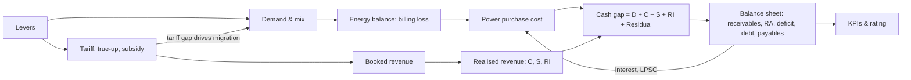

# India DISCOM Policy Simulator — Research & Model Specification

**Version 0.2 · September 2026 · Source-verified edition**

**Rules applied in this version**

- **Sourced facts only.** Every factual statement carries a source number `[n]` from the list at the end. Nothing is taken from background knowledge. Where a value is a *modelling choice* rather than a fact, it is labelled **design choice**.
- **One government source.** Official statistics come from a single government document: the Lok Sabha reply to Unstarred Question 3075, 18 December 2025 [1]. When a secondary source reports a different figure for the same indicator, the Lok Sabha figure is used.
- **Analytical backbone.** The uploaded CSEP study, *Breaking Down the Gap in DisCom Finances: Explaining the Causes of Missing Money* (Devaguptapu & Tongia, May 2023) [2], supplies the gap-decomposition method, the cash-basis accounting and the historical calibration series (FY2006-07 to FY2020-21).
- **Other sources** are rating agencies, research bodies and trade press. Their figures are attributed to them.

---

## 1. Why cash-basis accounting must drive the model (CSEP)

CSEP's central findings, which shape the whole simulator design:

1. **Tariff orders show no gap when they are set; the gap appears afterwards.** SERCs set tariffs ex-ante with virtually no cost–revenue gap. The gap appears ex-post, and true-ups do not close it [2].
2. **The cash gap is large.** For 59 public utilities in FY2020-21, the cash-basis gap was **₹1,04,091 crore, or ₹1.14 per kWh sold**, *after* counting UDAY grants and other income [2]. Before grants, it was ₹1.69/kWh (₹1,54,743 crore) [2].
3. **Accrual accounting understates the problem.** It counts revenue that was booked but never received (unpaid subsidy, "regulatory income") [2].
4. **National totals mislead.** "Profit of one DisCom does not offset loss of another." The model must therefore compute every indicator per DISCOM and must never net surpluses against deficits [2].
5. **DISCOMs themselves are responsible for only part of the gap.** Over 15 years, excess billing loss plus consumer non-collection explain about 28% of the gap. Unpaid subsidy plus regulatory income explain about 13%. A **residual of 58.9%** remains, which CSEP reads as tariffs that are not cost-reflective and a failed true-up process [2].

---

## 2. Baseline and historical data

### 2.1 Official national indicators (single government source [1])

| Indicator | Value | Note |
|---|---|---|
| AT&C loss, national | 21.9% (FY21) → **16.16% (FY25)** | [1] |
| ACS–ARR gap, national | ₹0.69/kWh (FY21) → **₹0.11/kWh (FY25)** | [1]. Official basis; compare with CSEP's cash basis in §2.3 |
| Outstanding DISCOM debt, 31.03.2025 | **₹7,18,793 crore**, counting only TNPDCL for Tamil Nadu (₹8,05,422 crore including legacy TANGEDCO) | [1] |
| Private-sector DISCOM debt | ₹7,595 crore | [1] |
| Payables for power purchase | 132 days (FY24) → **120 days (FY25, provisional)** | [1] |
| Legacy dues to gencos, traders and transcos | ₹44,701 crore (Mar 2024) → ₹18,857 crore (Mar 2025) | [1] |
| AT&C under UDAY | 23.70% (FY16) → 20.78% (FY20) | [1] |

The same reply lists the government's measures [1]:
- RDSS, with funds linked to performance
- Performance-linked additional state borrowing of 0.5% of GSDP
- Additional prudential norms for lending to state utilities
- Rules for Fuel and Power Purchase Cost Adjustment (FPPCA) and cost-reflective tariffs
- Rules and an SOP for subsidy accounting and release

### 2.2 Current-year indicators from non-government sources

| Indicator | Value | Source |
|---|---|---|
| Sector PAT, FY25 (accrual) | +₹2,701 crore, versus a loss of ₹25,553 crore in FY24 | Power Line [3] |
| Accumulated losses, end FY25 | ₹6.47 lakh crore, about 2% of GDP | [3] |
| Book losses of state-owned DISCOMs | ₹9,400 crore in FY25 (₹57,200 crore in FY23) | ICRA [4] |
| Regulatory assets, key DISCOMs | above ₹2.9 lakh crore | ICRA [4] |
| Power purchase cost share | 70–75% of DISCOM cost | ICRA [4] |
| Median approved PPC, 13 major DISCOMs | ₹4.90/unit FY26 (₹5.70 in FY23); ICRA expects it to rise | ICRA [4] |
| Median tariff revision | FY27 largely flat as of May 2026 | ICRA [4] |
| Interest cost | ₹77,653 crore in FY25 (₹69,821 crore in FY23) | [3] |
| Dues moved to lenders under LPS Rules | ₹1,13,737 crore of 10-year PFC/REC loans, covering 81% of targeted legacy dues | Prayas via [3] |
| Extra interest caused by subsidy shortfalls | ₹26,500 crore, FY17–FY25 | Prayas via [3] |
| Farm power subsidy, 13 agrarian states | above ₹1.3 lakh crore (FY25) | CEEW via [3] |
| Fixed costs vs fixed-charge revenue | Fixed costs are 38–56% of ARR; fixed charges bring in 9–20% of revenue | CEA report via [3] |
| Debt reported as unsustainable (disallowed in tariff) | ₹2,74,120 crore across UP, AP, MP, MH, RJ, TN | Energy Watch [5] |

**Accrual vs cash basis.** The official ACS–ARR gap for FY21 was ₹0.69/kWh [1], but CSEP's cash-basis gap for the same year was ₹1.14/kWh [2]. The difference comes from two adjustments CSEP makes: it treats "regulatory income" as *not received*, and it normalises per kWh *sold* rather than per kWh input [2]. The simulator should report both figures.

### 2.3 Historical calibration series: public utilities and power departments (CSEP [2], Table 8)

| | FY2006-07 | FY2015-16 | FY2019-20 | FY2020-21 |
|---|---|---|---|---|
| Cost of supply (₹ crore) | 1,54,058 | 5,14,941 | 7,13,289 | 7,22,126 |
| Net energy sold (MU) | 3,92,357 | 7,33,958 | 9,27,858 | 9,13,475 |
| ACS (₹/kWh sold) | 3.93 | 7.02 | 7.69 | 7.91 |
| Gap, realised basis, excluding grants (₹ crore) | 23,073 | 99,219 | 1,39,457 | 1,54,743 |
| Gap, realised basis, including grants (₹ crore) | 21,184 | 93,137 | 83,829 | 1,04,091 |
| ACS–ARR gap (₹/kWh sold) | 0.54 | 1.27 | 0.90 | 1.14 |
| Gap as % of cost | 13.75% | 18.09% | 11.75% | 14.41% |

**Growth rates, FY07–FY21 (CAGR)** [2]:

| Item | CAGR |
|---|---|
| Total cost | 11.7% |
| Power procurement cost | 10.2% |
| Revenue from consumers and operations | 10.2% |
| Support (tariff subsidies, grants, other income) | 18.6% |
| Realised gap | 12.1% |
| Sales volume | 6.2% |
| Average billing rate | 4.7% |

**Operational series** (CSEP Tables 6–7 [2]):

| | FY2006-07 | FY2019-20 | FY2020-21 |
|---|---|---|---|
| AT&C loss achieved | 30.47% | 21.50% | 23.02% |
| Average power purchase cost (₹/kWh) | 2.47 | 4.70 | 4.68 |
| Average billing rate, incl. subsidy booked (₹/kWh) | 3.30 | 6.30 | 6.32 |
| Billing inefficiency (1 − BE) | 26.17% | 15.04% | 16.38% |
| Billing inefficiency beyond target | 0.75% | 1.80% | 3.53% |
| Subsidy booked (₹ crore) | 13,590 | 1,18,391 | 1,29,267 |
| Subsidy booked as % of cost of supply | 8.82% | 16.60% | 17.90% |
| Subsidy unrealised (₹ crore) | 754 | 5,886 | 20,228 |

**Balance sheet, FY2020-21, public utilities** [2]:

| Item | ₹ crore |
|---|---|
| Regulatory assets | 45,907 |
| Trade receivables | 2,34,072 |
| Payables for power and fuel | 2,52,736 |
| Other current liabilities | 2,53,040 |
| Aggregate net worth | −22,147 → **−1,70,447** over 15 years |
| Booked return on equity | 3.28% (FY19, 39 DISCOMs) |

---

## 3. Why DISCOMs are in debt: the gap decomposition

### 3.1 CSEP's five components [2]

For each year, the cash-basis gap between cost and realised revenue (including grants) is split into five parts:

| Code | Component | Primary responsibility [2] | Where it ends up [2] | Cumulative FY07–FY21 [2] |
|---|---|---|---|---|
| **D** | Excess distribution (billing) loss beyond the regulator's target, valued at average power purchase cost | DISCOM | Lost permanently; appears on no balance sheet | ₹70,829 crore (7.1%) |
| **C** | Consumer non-collection beyond target | DISCOM (but much of it is owed by government consumers) | Trade receivables | ₹2,12,247 crore (21.1%) |
| **S** | Subsidy booked but not paid by the state | State government | *Not listed separately on DISCOM balance sheets* | ₹89,509 crore (8.9%) |
| **RI** | Regulatory income: cost approved but recovery deferred | Regulator | Regulatory assets | ₹40,945 crore (4.1%) |
| **Residual** | Gap left after D, C, S and RI | DISCOM and regulator together (tariff setting, true-up) | Accumulated deficit | ₹5,92,518 crore (58.9%) |
| | **Total** | | | **₹10,06,048 crore** |

**FY2020-21 worked example (₹ crore)** [2]:

| Component | ₹ crore |
|---|---|
| Consumer non-collection (C) | 22,295 |
| Excess billing loss (D) | 18,022 |
| Unpaid subsidy (S) | 20,228 |
| Regulatory income (RI) | 7,236 |
| Residual | 36,310 |
| **Total gap** | **1,04,091** |

The components D, C, S and RI came to ₹0.74/kWh, leaving a residual of ₹0.40/kWh, or 3.43% of total cost [2].

**How the balance sheet tracks the gap:** in most years, the annual change in the accumulated deficit closely matches the *residual gap plus unpaid subsidy* [2].

### 3.2 Additional causes documented in current sources

- **Tariffs are not cost-reflective, and hikes are small.** ICRA reports that FY27 tariff revisions are largely flat [4] and that the median hike was 1.9% in FY26 [6]. ICRA estimated that closing the FY24 gap of 46 paise/unit would need an all-India hike of about 4.5% together with AT&C below 15% [6].
- **Fuel and power cost pass-through is incomplete.** Several states lag in fully adopting FPPAS [4].
- **Free-power schemes enlarge subsidy needs.**
  - Punjab: 300 free units a month for households; domestic subsidy projected at ₹8,785 crore, alongside ₹10,175 crore for agriculture [7].
  - Bihar: 125 free units, costing ₹3,797 crore in FY26 [8].
  - Karnataka: Gruha Jyothi scheme, 200 units [9].
  - Rajasthan: 150 free units [10].
- **Government and local-body dues.** Nationally, CSEP cites estimates of about ₹62,931 crore, and a Prime Ministerial statement of about ₹1 lakh crore [2].
  - Tamil Nadu: ₹5,135 crore owed to TNPDCL [11].
  - Telangana: ₹28,842 crore, including ₹14,193 crore from lift irrigation [12].
- **The true-up cycle creates a pipeline problem.** The petition is filed in year N−1, the true-up order comes in year N+1.5, and it takes effect in year N+2. The two-year lag imposes carrying costs [2].
- **Expensive and surplus PPAs.** Lower demand does not reduce fixed charges [2]. In UP, the engineers' federation claims ₹6,761 crore a year is paid for power that isn't bought [13].
- **Premium consumers are leaving.** CSEP expects commercial and industrial consumers to move to renewable and third-party supply, which erodes the cross-subsidy base [2]. MSEDCL attributed a loss of about ₹1,700 crore to open-access migration [14].
- **Coping mechanisms that hide the gap.** DISCOMs delay payments to generators, take on more debt, and receive state equity that often creates no assets. Regulators frequently disallow full RoE on that equity [2].

---

## 4. State-by-state diagnosis

Debt and payable days are from the Lok Sabha reply [1], as on 31 March 2025.

| State | DISCOMs | Debt (₹ crore) | Payable days FY24→FY25 | Documented drivers | Documented actions |
|---|---|---|---|---|---|
| Tamil Nadu | TNPDCL | 1,01,782 | 184 → 78 | Tariffs inadequate relative to cost; tariff orders lag; own generation under-used [15]. Government and local-body dues ₹5,135 crore [11]. Accumulated losses ₹1,19,153 crore [3] | Tariff hike in September 2022 [15]. AT&C 11.85% in FY25 [15]. TNEB restructured into four entities in 2024 [16] |
| Rajasthan | JVVNL, AVVNL, JdVVNL | 98,488 | 63 → 51 | Accumulated losses ₹92,463 crore [3]. Regulatory assets ₹47,100 crore as of FY25 [17]. RERC disallowed ₹768 crore of costly short-term power purchased by JVVNL [18] | State takes over losses under the 0.5% GSDP scheme and released 90% of FY24 losses [19]. Debt reduced by ₹1,352 crore in FY26 [3] |
| Maharashtra | MSEDCL (+ AEML, Tata Power Mumbai, BEST) | 90,659 | 104 → 111 | Agricultural consumers account for 78% of net receivables [3]. Farm supply over-estimated by 10,000 MU in FY19 (MERC working group) [20]. Regulatory assets equal to ₹1.75/kWh in FY21 [2]. Adverse auditor opinion led to a rating penalty [21] | Farm business demerged into MSAPL (April 2026); ₹32,679 crore of farm dues written off against government securities; ₹26,848 crore transferred to MSAPL; IPO planned [3]. 16 GW of solar tenders for agricultural supply [22] |
| Andhra Pradesh | APEPDCL, APSPDCL, APCPDCL | 77,600 | 105 → 105 | High ACS–ARR gap in FY24 [6]. Part of the unsustainable-debt group [5]. APCPDCL adverse audit [21] | — |
| Uttar Pradesh | DVVNL, KESCO, MVVNL, PaVVNL, PuVVNL (+ NPCL) | 61,395 | 153 → 156 | Accumulated losses ₹1,00,858 crore [3]. AT&C close to or above 20% [4]. Among the top five loss-making states in FY25 [4]. ACS–ARR gap worsened at MVVNL, PuVVNL and KESCO [23] | PaVVNL upgraded to A+ [21]. Privatisation of PuVVNL and DVVNL (42 of 75 districts) proposed, opposed by unions [13] |
| Telangana | TGSPDCL, TGNPDCL, TGRPDCL | 59,230 | 310 → 295 | Combined losses ₹69,741 crore [3]. Farm supply exceeded approved volume by about 33,800 MU, costing ₹18,725 crore [24]. Government dues ₹28,842 crore; ₹14,928 crore of true-up support unpaid [12]. AT&C close to or above 20% [4] | TGRPDCL, a farm-supply DISCOM, received its licence in July 2026. It took over ₹26,950 crore of payables and a ₹9,032 crore working-capital loan [3] |
| Madhya Pradesh | MPPoKVVCL, MPMaKVVCL, MPPaKVVCL | 49,239 | 211 → 208 | AT&C close to or above 20% [4]. Unrealised subsidy at MPMaKVVCL was ₹1.05/kWh in FY21 against a national ₹0.22 [2]. Booked RoE mostly below 10%, versus 16% in MYT regulations [2] | Poorv Kshetra's ACS–ARR gap improved by more than ₹0.50/kWh [23] |
| Karnataka | BESCOM, MESCOM, CHESCOM, HESCOM, GESCOM | 47,993 | 177 → 152 | ESCOMs lost about ₹4,900 crore in FY25, including ₹2,802 crore at BESCOM [9]. Irrigation pump-set cost ₹20,640 crore versus a budgeted subsidy of ₹16,021 crore [25]. BESCOM in grade C with an adverse audit [21] | Proposal to raise C&I tariffs and lower pump-set tariffs [9]. BESCOM revises consumer security deposits annually [2] |
| Jharkhand | JBVNL | 22,381 | 420 → 384 | AT&C close to or above 20%; among top five loss states [4]. Grade C [21] | ACS–ARR gap improved by more than ₹0.50/kWh [23] |
| Haryana | DHBVNL, UHBVNL | 20,311 | 38 → 46 | 16th Finance Commission cites Haryana as having emerged from heavy debt [26] | Vigilance staff get a 10% bonus on amounts recovered [2]. A separate agricultural DISCOM was proposed in 2026-27 [3] |
| Kerala | KSEBL (+ Thrissur Corp. ED) | 17,638 | 95 → 69 | Regulatory assets ₹7,123 crore in FY23 [17] | ACS–ARR gap improved [23] |
| Punjab | PSPCL | 17,411 | 40 → 45 | Free power for farms plus 300 free domestic units [7] | Upgraded to A+ [21]. State PAT ₹6,216 crore in FY25 [3]. The state regulator penalises the government for unpaid subsidy [2] |
| West Bengal | WBSEDCL (+ CESC, IPCL) | 15,279 | 159 → 172 | — | WB state utilities rated A or A+ [23] |
| Bihar | NBPDCL, SBPDCL | 14,002 | 109 → 97 | 125 free units [8]. SBPDCL AT&C 48.29% in FY20 against a UDAY target of 15% [1] | NBPDCL upgraded from B to A [21]. State PAT ₹2,100 crore in FY25 [3] |
| Himachal Pradesh | HPSEBL | 7,024 | 71 → 80 | — | — |
| Chhattisgarh | CSPDCL | 5,428 | 108 → 82 | Cumulative deficit ₹2,900 crore (FY24) [17] | Rated A or A+ [23] |
| Uttarakhand | UPCL | 1,729 | 39 → 61 | — | — |
| Meghalaya / Manipur / Assam / Tripura | MePDCL / MSPDCL / APDCL / TSECL | 1,474 / 745 / 1,131 / 0 | 212→193 / 76→74 / 41→62 / 94→— | MSPDCL defaulted to PFC [21] | Assam rated A or A+ [23] |
| Gujarat | DGVCL, MGVCL, PGVCL, UGVCL (+ Torrent Ahmedabad and Surat) | 258 | 3 → 4 | — | All six Gujarat utilities are in the national top 10 [23]. Cited as a model state [26] |
| Delhi | BRPL, BYPL, TPDDL (+ NDMC) | not in [1] | 277 → 389 | Regulatory assets ₹27,200 crore (Mar 2024), equal to ₹10.27/kWh in FY21 terms [2][27] | Supreme Court ordered recovery by March 2028 [27] |
| Odisha | TPNODL, TPCODL, TPSODL | — | 54 → — | — | Privatised, with buyers reportedly getting a relatively clean balance sheet [2]. TPNODL and TPCODL are in the top 10 [23] |

**Concentration:** Tamil Nadu, Rajasthan, Maharashtra, Andhra Pradesh, Uttar Pradesh and Telangana hold about 67% of gross DISCOM debt [4].

**CSEP clustering of 43 public DISCOMs, FY2019-20** [2]:

| Group | Number of DISCOMs |
|---|---|
| Already had no operating gap | 7 |
| Fixing S alone closes the gap | +3 |
| Fixing S and RI closes it | +2 |
| Fixing D, S and RI closes it | +3 |
| Fixing all four (D, C, S, RI) closes it | +10 |
| **Still have a gap after all four are fixed** (residual) | **18** |

For the utilities in this last group, CSEP concludes that closing the gap requires a tariff increase or external support [2].

---

## 5. The utility universe (names as they appear in the sources)

The country has 72 distribution utilities. Sixty-five were rated in the 14th Integrated Rating: 42 state-government utilities, 12 private DISCOMs and 11 power departments [23].

| State / UT | State-owned | Private / JV | Power dept. / municipal |
|---|---|---|---|
| Andhra Pradesh | APEPDCL, APSPDCL [1], APCPDCL [21] | | |
| Arunachal Pradesh | | | Arunachal PD [1] |
| Assam | APDCL [1] | | |
| Bihar | NBPDCL, SBPDCL [1] | | |
| Chhattisgarh | CSPDCL [1] | | |
| Delhi | | BRPL, BYPL (Reliance Infra 51% / Delhi govt 49%) [27]; TPDDL [27] | NDMC [23] |
| Goa | | | Goa PD [1] |
| Gujarat | DGVCL, MGVCL, PGVCL, UGVCL [1] | Torrent Power Ahmedabad, Torrent Power Surat [23] | |
| Haryana | DHBVNL, UHBVNL [1] | | |
| Himachal Pradesh | HPSEBL [1] | | |
| Jammu & Kashmir | JKPDD (UDAY-era entity) [1] | | |
| Ladakh | | | Ladakh PD [23] |
| Jharkhand | JBVNL [1] | | |
| Karnataka | BESCOM, CHESCOM, GESCOM, HESCOM, MESCOM [1] | | |
| Kerala | KSEBL [1] | | Thrissur Corporation Electricity Dept [23] |
| Madhya Pradesh | MPMaKVVCL, MPPaKVVCL, MPPoKVVCL [1] | | |
| Maharashtra | MSEDCL [1]; MSAPL (farm DISCOM) [3] | AEML [23]; Tata Power Mumbai [28] | BEST [23] |
| Manipur | MSPDCL [1] | | |
| Meghalaya | MePDCL [1] | | |
| Mizoram | | | Mizoram PD [1] |
| Nagaland | | | Nagaland PD [1] |
| Odisha | | TPNODL, TPCODL, TPSODL [23] (Tata Power has four Odisha DISCOMs [28]) | |
| Punjab | PSPCL [1] | | |
| Rajasthan | AVVNL, JdVVNL, JVVNL [1] | | |
| Sikkim | | | Sikkim PD [1] |
| Tamil Nadu | TNPDCL [1] | | |
| Telangana | TGSPDCL, TGNPDCL, TGRPDCL [29] | | |
| Tripura | TSECL [1] | | |
| Uttar Pradesh | DVVNL, KESCO, MVVNL, PaVVNL, PuVVNL [1] | Noida Power Co. (NPCL) [23] | |
| Uttarakhand | UPCL [1] | | |
| West Bengal | WBSEDCL [2] | CESC Ltd [28]; India Power Corp. (IPCL) [30] | |
| DNH & DD | DNHPDCL, Daman & Diu PD (UDAY-era) [1] | DNH&DDPCL (Torrent Power JV) [28] | |
| Puducherry / A&N / Lakshadweep | | | Puducherry PD, A&N PD, Lakshadweep ED [1] |

**14th IR (FY25) top 10:** Torrent Ahmedabad, Torrent Surat, AEML, UGVCL, MGVCL, PGVCL, DGVCL, NPCL, TPNODL, TPCODL [23].
**A+ state DISCOMs:** four in Gujarat, one in Punjab and one in UP [31].
**Grade C/C-:** 11 utilities, including BESCOM and JBVNL [21].

---

## 6. What to measure: the KPI set

### 6.1 Definitions from CSEP [2]
- **Billing inefficiency (D-basis loss)** = 1 − Billing efficiency = 1 − (energy billed ÷ net input energy)
- **Consumer collection loss** = share of consumer billing not collected. It excludes subsidy.
- **Subsidy non-payment** = Subsidy booked − Subsidy realised
- **AT&C loss** combines the kWh loss (billing) with the rupee loss (collection). Its components are *not additive*, and should be reported separately.
- **ACS** = total cost ÷ net energy **sold** (CSEP basis)
- **Realised ARR** = (revenue from operations collected + tariff subsidy received + grants + other income) ÷ energy sold. Regulatory income is excluded.
- **Cash gap** = total cost − realised revenue (including grants)
- **Residual gap** = cash gap − (D + C + S + RI)

### 6.2 Financial health
- PAT (accrual) and cash-basis PAT
- Accumulated deficit and net worth. CSEP's "adjusted total equity" excludes capital grants [2].
- Debt; payable days, which the government tracks officially [1]
- Regulatory assets as % of ARR. The Supreme Court caps them at 3% [17].
- Booked RoE vs regulatory RoE (14–16%) [2]

### 6.3 Rating KPI
PFC Integrated Rating weights: Financial Sustainability 75, Performance Excellence 13, External Environment 12. The ACS–ARR gap alone carries 35% [32]. A+ requires a score above 85 [28]. Red cards apply for adverse audit opinions or defaults [21].

### 6.4 Transition KPIs (for the 2070 scenario)
- Per-capita consumption served: 2,000 kWh by 2030 and more than 4,000 kWh by 2047 [33]
- AT&C in single digits in all states [34]
- Non-fossil procurement share, with the draft Bill's proposed RPO shortfall penalty of 35–45 paise per unit [35]

---

## 7. Policy levers and what each changes

The **BAU** column gives a sourced value where one exists. Otherwise it says **calibrate**, meaning the value must be estimated from state data.

### A. Tariff and regulatory process

| Lever | BAU (sourced) | What it moves in the model |
|---|---|---|
| A1 Annual tariff revision | Median 1.9% (FY26) [6]; FY27 largely flat [4] | Tariff by category → billed revenue → Residual |
| A2 True-up lag and coverage | About 2 years; true-ups cover only part of the allowable gap [2] | Timing of recovery; carrying cost; Residual |
| A3 Quarterly pro-forma true-up | Proposed by CSEP [2] | Shortens A2 |
| A4 FPPAS monthly pass-through | Some states lag in adoption [4] | Moves PPC deviations out of Residual |
| A5 Index-linked automatic revision | Draft NEP 2026 [34] | Floor on A1 |
| A6 Suo-motu tariff orders | APTEL 2011; draft amendment [2][35] | Removes years with no tariff revision |
| A7 RA cap and liquidation period | Supreme Court: 3% of ARR; existing RAs within 4 years from 1 Apr 2024; new RAs within 3 years [17] | RI and regulatory-asset stock; tariff surcharge |
| A8 Fixed-charge recovery path | CEA proposal: 25% (2030) → 50% (2035) for domestic and agricultural; 100% for C&I [3] | Revenue stability; exposure to rooftop solar and open access |
| A9 Cross-subsidy removal for manufacturing, railways and metro | Within 5 years (draft Bill) [35] | Category tariffs move to cost; subsidy or residual shifts |
| A10 RoE allowed on paid-up equity | Full RoE at 15% would add ₹27,409 crore, about ₹0.30/kWh (FY20) [2] | Cost base; tariff |

### B. State government and subsidy

| Lever | BAU | Model effect |
|---|---|---|
| B1 Subsidy realisation | Unrealised 15.65% of booked in FY21 [2] | S |
| B2 Late-payment penalty on unpaid subsidy at the generator LPSC rate | Punjab's regulator already does this [2] | S, interest recovery |
| B3 Record unpaid subsidy as a receivable | Not done today [2] | Balance-sheet transparency |
| B4 Free-unit thresholds | PB 300, KA 200, BR 125, RJ 150 units [7][8][9][10] | Subsidy booked; S exposure |
| B5 Clearance of government and local-body dues | calibrate from [11][12] | C |
| B6 State loss takeover (0.5% GSDP scheme) | Rajasthan 90% of FY24 loss [19] | Grants; debt |
| B7 Farm-DISCOM demerger | TG and MH in 2026 [3] | Moves farm receivables and debt to a separate entity |

### C. DISCOM operations

| Lever | BAU | Model effect |
|---|---|---|
| C1 Billing-loss target trajectory | FY21 target equivalent 12.85%; actual 16.38% [2] | D |
| C2 Separate D target with 100% retention of over-achievement (vs 50:50 today) | CSEP proposal [2] | D incentive |
| C3 Smart and prepaid metering | 7.24 crore installed (5.73 crore under RDSS) of 20.33 crore sanctioned by Jun 2026; RDSS ends Mar 2028 [36] | D and C, with a lag; capex |
| C4 Consumer security deposit (two months of billing) | BESCOM practice [2] | C |
| C5 Feeder-level accounting and staff incentives | Haryana 10% bonus [2] | D, C |
| C6 Allowed collection loss in tariff | About 0.5% [2] | Target for C |

### D. Power procurement

| Lever | BAU | Model effect |
|---|---|---|
| D1 PPC trajectory | ₹4.90/unit FY26, expected to rise with new thermal and pricier RE tenders [4] | Cost |
| D2 Surplus / legacy PPA fixed charges | UP union claim ₹6,761 crore a year [13] | Fixed cost |
| D3 Short-term purchase disallowances | JVVNL ₹768 crore [18] | Cost recovery |
| D4 Solar for agricultural feeders | MH 16 GW tenders [22] | Farm supply cost; subsidy |

### E. Demand and customer mix

| Lever | BAU | Model effect |
|---|---|---|
| E1 Demand growth | 2,000 → >4,000 kWh per capita (2030 → 2047) [33] | Sales |
| E2 C&I migration (open access, rooftop, captive) | MSEDCL ~₹1,700 crore loss [14]; trend flagged by CSEP [2] | Cross-subsidy base |
| E3 USO exemption for ≥1 MW consumers | Draft Bill [35] | Load shed; margin |

### F. Balance sheet and finance

| Lever | BAU | Model effect |
|---|---|---|
| F1 One-time conditional debt takeover | NITI Aayog proposal [37]; UDAY precedent of 75% [1] | Debt; interest |
| F2 SPV for legacy debt | 16th Finance Commission: ~₹7.5 lakh crore, repayment via SASCI [3][26] | Clean balance sheet |
| F3 Clearing accumulated S and RI | CSEP: ₹69,281 crore S and ₹33,709 crore RI to FY20; limited P&L effect [2] | Liquidity |
| F4 Refinancing rate | PFC/REC rates cut by 0.9–1.4 pp [3] | Interest |
| F5 Use of recovered funds (pay gencos first) | CSEP recommendation [2] | Payables; LPSC |

### G. Structure

| Lever | BAU | Model effect |
|---|---|---|
| G1 Privatisation options | GoM options: 51% sale with debt absorbed; 26% plus management control; listing if rated A [38][39] | Efficiency path; debt |
| G2 Listing | MSEDCL IPO of ₹8,000–10,000 crore planned [3] | Equity |
| G3 Multiple licensees on a shared network | Draft Bill [35] | Competition |

---

## 8. Model equations

The model is an annual stock-and-flow system. It runs per DISCOM, with no netting across DISCOMs [2], over FY2025–FY2070. It is calibrated on the CSEP FY07–FY21 series [2] and anchored to the FY25 official figures [1].



**Energy and D**
```
Input[t]      = Sales[t] / (1 − BL[t])                      BL = billing inefficiency
D[t]          = (BL[t] − BL_target[t]) × Input[t] × APPC[t]   CSEP: valued at gross input × APPC
```
**Booked revenue**
```
TariffBooked[t] = Σc Sales[c,t] × Tariff[c,t]
SubBooked[t]    = Σc Sales[c,t] × subsidy_rate[c,t]
```
**Realisation**
```
C[t]   = (CL[t] − CL_target[t]) × consumer billing[t]       CL_target ≈ 0.5%
S[t]   = SubBooked[t] × (1 − realisation[t])
RI[t]  = regulatory income booked but deferred (capped per the Supreme Court: RA ≤ 3% ARR)
Realised[t] = TariffBooked[t] × (1 − CL[t]) + SubBooked[t] − S[t] + Grants[t] + OtherInc[t]
```
**Cost and gap**
```
Cost[t]     = PPC[t] + Employee[t] + Interest[t] + Depreciation[t] + Other[t]
CashGap[t]  = Cost[t] − Realised[t]
Residual[t] = CashGap[t] − (D[t] + C[t] + S[t] + RI[t])
```
**Tariff and true-up**
```
Tariff[c,t] = Tariff[c,t−1] × (1 + hike[c,t]) + FPPAS_passthrough[t]
            + TrueUp_coverage × AllowableGap[t − lag] + RA_liquidation[t]
```
**Balance sheet (CSEP mapping)**
```
TradeReceivables[t] = TradeReceivables[t−1] + C[t] − recoveries[t]
RegAssets[t]        = RegAssets[t−1] + RI[t] − RA_liquidation[t]
UnpaidSubsidy[t]    = UnpaidSubsidy[t−1] + S[t] − arrears_paid[t]     (off-book today)
AccDeficit[t]       ≈ AccDeficit[t−1] + Residual[t] + S[t]            (CSEP empirical link)
Debt[t] + Payables[t] = previous + CashGap[t] − Equity[t] − Takeover[t]
```
**Solver outputs:** the break-even tariff path, and the minimum lever mix at which the cash gap is ≤ 0 by the target year.

---

## 9. Scenarios

Target years are defined against the draft NEP 2026, which aligns with **Viksit Bharat @2047** and **net zero by 2070** [34]. "Profitable by 2048" is read as FY2047-48.

**Design choice:** the thresholds in the tests below are proposals for the simulator. They are not taken from any source.

| Test | Criteria |
|---|---|
| **Profitable DISCOM (FY2047-48)** | Cash-basis gap ≤ 0, per DISCOM, for 3 consecutive years; RI = 0 and RA ≤ 3% of ARR [17]; S = 0; single-digit AT&C [34]; payables ≤ 45 days (design choice); grade A or better with no red card [21][32] |
| **Viksit Bharat DISCOM (2070)** | Passes the FY48 test, plus: serves >4,000 kWh per capita (reached by 2047) [33]; non-fossil procurement on the net-zero path [34]; full smart metering [36]; no legacy debt (F1/F2) |

| ID | Scenario | Lever settings |
|---|---|---|
| S0 | BAU | A1 at the ~flat recent median [4][6]; S, C and D at recent rates [2]; true-up lag 2 years [2] |
| S1 | Announced policy | S0 + Supreme Court RA path [17]; RDSS metering by FY28 [36]; CEA fixed-charge path [3]; draft Bill and NEP reforms [34][35] |
| S2 | **Profitable by FY48** | S1 + B1/B2 (S → 0), B5, C1–C6 (D and C → targets), A2/A3 (quarterly true-up), A1 solved to close the Residual, F1/F2 conditional clean-up |
| S3 | **Viksit Bharat 2070** | S2 + D4, E1 growth, non-fossil procurement path, A8 full fixed-charge reform |
| S4a / b / c | Structural reforms | Privatisation [38][39]; farm demerger [3]; listing [3][38] |
| S5 | Stress | More free units [7][8]; PPC rise [4]; flat tariffs [4]; faster C&I migration [2] |

**Key insight to carry into the scenarios:** for the 18 residual-gap DISCOMs, efficiency fixes and balance-sheet clean-ups are *not enough*. S2 must include tariff action, or explicit external support, for them [2].

---

## 10. Data sources for build-out

- **Calibration (FY07–FY21):** CSEP Tables 1, 6, 7, 8, 9 and 11 and Figures 20–22 [2]. CSEP's underlying data are PFC's *Report on Performance of Power Utilities* and tariff orders.
- **FY25 anchor:** the Lok Sabha reply [1], covering state debt, payable days, UDAY targets, and national AT&C and ACS–ARR.
- **State detail:** from the sources cited in §4.

**Data gap to fill:** per-DISCOM D, C, S, RI and Residual for FY22–FY25. These need PFC utility reports and SERC true-up orders, which I could not access in this session.

---

## Sources

**Government (only one)**
1. Ministry of Power, Lok Sabha Unstarred Question 3075, answered 18.12.2025, "Outstanding debt and payables of DISCOMs" (Annexures I–III). https://eparlib.sansad.in/bitstream/123456789/3018498/1/AU3075_vtM66t.pdf

**Uploaded document**
2. R. Devaguptapu & R. Tongia, *Breaking Down the Gap in DisCom Finances: Explaining the Causes of Missing Money*, CSEP Impact Series 052023-01, May 2023.

**Other sources**

3. Power Line, "Strengthening Discom Finances: Privatisation, debt relief, market access emerge as long-term solutions," 18 Sep 2026. https://powerline.net.in/2026/09/18/strengthening-discom-finances-privatisation-debt-relief-market-access-emerge-as-long-term-solutions/
4. G. Kadam (ICRA), "Reducing the Cash Gap," Power Line, Jul 2026. https://powerline.net.in/2026/07/17/reducing-the-cash-gap-operational-improvement-key-to-strengthening-discom-finances/
5. Energy Watch, "Discom debt at Rs 7.26 lakh cr…," 9 Feb 2026. https://www.energywatch.in/power/discom-debt-at-rs-726-lakh-cr-tamil-nadu-rajasthan-maharashtra-among-biggest-defaulters-shripad-naik
6. T&D India, "Average tariff hike of 4.5 per cent needed to eliminate ACS-ARR gap, notes ICRA." https://www.tndindia.com/average-tariff-hike-of-4-5-per-cent-needed-to-eliminate-acs-arr-gap-notes-icra/
7. The Tribune, "Rising domestic power subsidy bill hits finances." https://www.tribuneindia.com/news/punjab/rising-domestic-power-subsidy-bill-hits-finances
8. ETV Bharat, "Bihar Cabinet approves free electricity scheme," 18 Jul 2025. https://www.etvbharat.com/en/!state/bihar-cabinet-approves-free-electricity-scheme-enn25071805576
9. UNI, "Karnataka ESCOMs seek power tariff hike after ₹4,900 crore loss," Jan 2026. https://www.uniindia.com/karnataka-escoms-seek-power-tariff-hike-after-4-900-crore-loss/south/news/3708930.html
10. Mercom, "Free electricity programs a disincentive for PM Surya Ghar rooftop solar adoption." https://mercomindia.com/free-electricity-programs-disincentive-for-rooftop-solar-adoption
11. DT Next, "TNPDCL faces Rs 5,135 crore bill default." https://www.dtnext.in/news/tamilnadu/tamilnadutnpdcl-faces-rs-5135-crore-bill-default-830072
12. South First, Telangana power-sector White Paper, 21 Dec 2023. https://thesouthfirst.com/news/brs-failure-pushed-discoms-into-debt-trap-dycm-vikramarka-tells-assembly/
13. Outlook Business, "Over 27 lakh power workers take to the streets against discom privatisation in UP." https://www.outlookbusiness.com/news/over-27-lakh-power-workers-take-to-the-streets-against-discom-privatisation-in-up
14. Power Line, "MSEDCL: Taking initiatives to improve its financial and operational performance," Dec 2017. https://powerline.net.in/2017/12/09/msedcl/
15. ICRA, rating rationale, TNPDCL. https://www.icra.in/Rating/GetRationalReportFilePdf?id=143852
16. South First, Tamil Nadu power-sector White Paper. https://thesouthfirst.com/tamilnadu/ageing-infrastructure-stalled-projects-tamil-nadu-power-sector-buried-under-%e2%82%b92-47-lakh-crore-debt/
17. Power Line, "Enforcing Financial Discipline: Supreme Court issues order on liquidation of mounting regulatory assets," Sep 2025. https://powerline.net.in/2025/09/01/enforcing-financial-discipline-supreme-court-issues-order-on-liquidation-of-mounting-regulatory-assets/
18. SolarQuarter, "RERC tightens financial oversight on Rajasthan discoms," Apr 2026. https://solarquarter.com/2026/04/06/rerc-tightens-financial-oversight-on-rajasthan-discoms-sets-path-for-2026-27/
19. Acuité Ratings, JVVNL rating rationale, Oct 2025. https://www.acuite.in/documents/ratings/revised/29154-RR-20251006.pdf
20. Hindustan Times (via PressReader), "MSEDCL in losses," Feb 2021. https://www.pressreader.com/india/hindustan-times-st-mumbai/20210204/281745567069213
21. EQ Mag, "14th Annual Integrated Rating & Ranking of Power Distribution Utilities – FY25." https://www.eqmagpro.com/14th-annual-integrated-rating-ranking-of-power-distribution-utilities-fy25-eq/
22. Angel One, "MSEDCL restructures farm power segment to reduce debt ahead of IPO," Jan 2026. https://www.angelone.in/news/ipos/maharashtra-discom-msedcl-restructures-farm-power-segment-to-reduce-debt-ahead-of-ipo
23. Power Line, "Benchmarking Discom Performance: 14th Integrated Rating and Ranking Report," Mar 2026. https://powerline.net.in/2026/03/16/benchmarking-discom-performance-highlights-of-the-mops-14th-integrated-rating-and-ranking-report/
24. Deccan Chronicle, "Telangana state discoms close to the bottom of the pile." https://deccanchronicle.com/nation/telangana-state-discoms-close-to-the-bottom-of-the-pile-centre-885116
25. Deccan Herald, "Bescom wants up to Re 1 hike for industries." https://www.deccanherald.com/india/karnataka/bengaluru/power-tariff-bescom-wants-up-to-re-1-hike-for-industries-3718125
26. Business Standard, "16th FC moots CSS overhaul, discom privatisation, subsidy bill pruning," Feb 2026. https://www.business-standard.com/budget/news/16th-fc-moots-css-overhaul-discom-privatisation-subsidy-bill-pruning-126020101237_1.html
27. Moneylife, "SC orders BSES discoms to liquidate Rs28,483 crore regulatory assets by 2028," Aug 2025. https://moneylife.in/article/sc-enforces-electricity-tariff-transparency-orders-bses-discoms-to-liquidate-rs28483-crore-regulatory-assets-by-2028/77923.html
28. T&D India, "Annual rating & ranking of discoms FY24: 11 utilities get highest grade." https://www.tndindia.com/annual-rating-ranking-of-discoms-fy24-11-utilities-get-highest-grade/
29. ThePrint, "Telangana farm power bet: new discom has 3 months to fix debt, staff, viability concerns." https://theprint.in/india/governance/telangana-farm-power-bet-new-discom-has-3-months-to-fix-debt-staff-viability-concerns/3009607/
30. Power Line, "10th integrated ratings of discoms launched," Aug 2022. https://powerline.net.in/2022/08/08/10th-integrated-ratings-of-discoms-launched/
31. T&D India, "14th Integrated Rating and Ranking Report: 22 utilities see improvement in grades," Jan 2026. https://www.tndindia.com/14th-integrated-rating-and-ranking-report-22-utilities-see-improvement-in-grades/
32. T&D India, "All four Gujarat state discoms score A+ in power ministry's integrated ranking." https://www.tndindia.com/all-four-gujarat-state-discoms-score-a-in-power-ministrys-integrated-ranking/
33. SolarQuarter, "Ministry of Power releases Draft National Electricity Policy," 21 Jan 2026. https://solarquarter.com/2026/01/21/ministry-of-power-releases-draft-national-electricity-policy-to-transform-indias-power-sector
34. Rau's IAS Compass, "Powering Viksit Bharat: Draft National Electricity Policy 2026." https://compass.rauias.com/current-affairs/draft-national-electricity-policy-2026/
35. PRS Legislative Research, "The Draft Electricity (Amendment) Bill, 2025." https://prsindia.org/billtrack/the-draft-electricity-amendment-bill-2025
36. T&D India, "India's smart meter population at 7.24 crore," 2026. https://www.tndindia.com/indias-smart-meter-population-at-7-24-crore-parliament/amp/
37. Business Standard, "NITI calls for one-time discom debt takeover," Feb 2026. https://www.business-standard.com/industry/news/niti-aayog-proposes-discom-debt-takeover-green-bonds-nuclear-net-zero-126021001648_1.html
38. The Tribune, "Power ministry warns 6 states on Discom reform." https://www.tribuneindia.com/news/india/power-ministry-warns-6-states-on-discom-reform-demands-privatisation-or-loss-reduction
39. Deccan Chronicle, "AIPEF condemns privatisation ultimatum by Group of Ministers," Oct 2025. https://www.deccanchronicle.com/southern-states/telangana/aipef-condemns-privatisation-ultimatum-by-group-of-ministers-1913711
